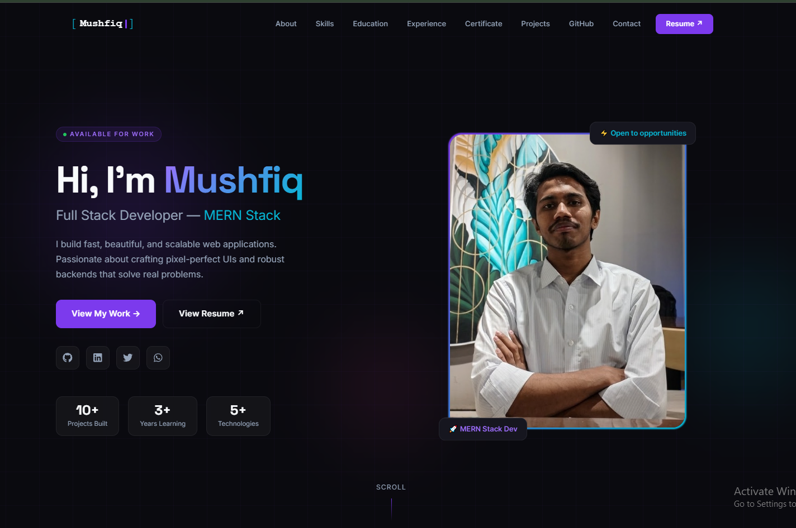
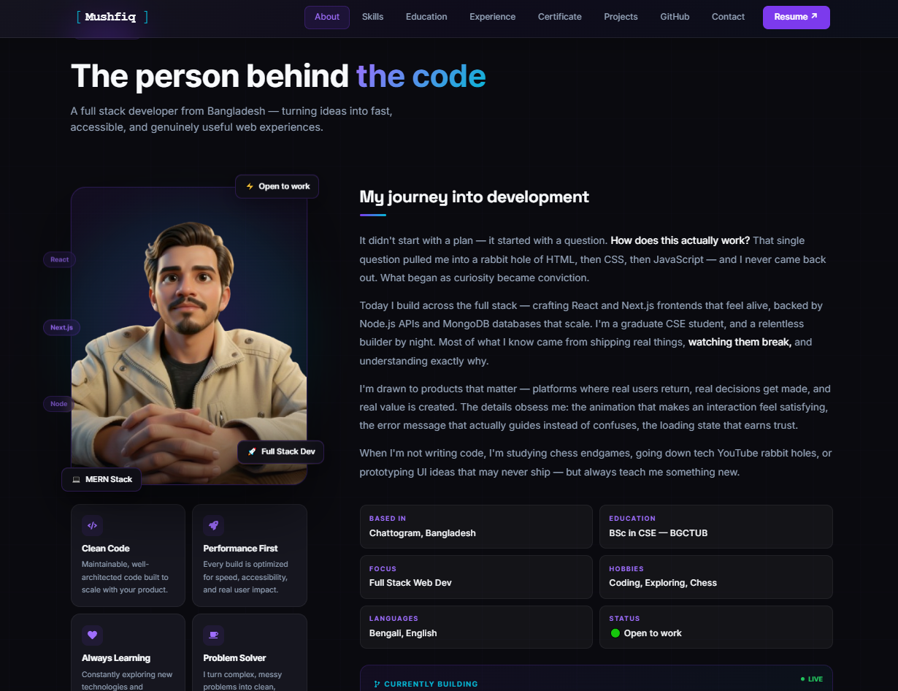
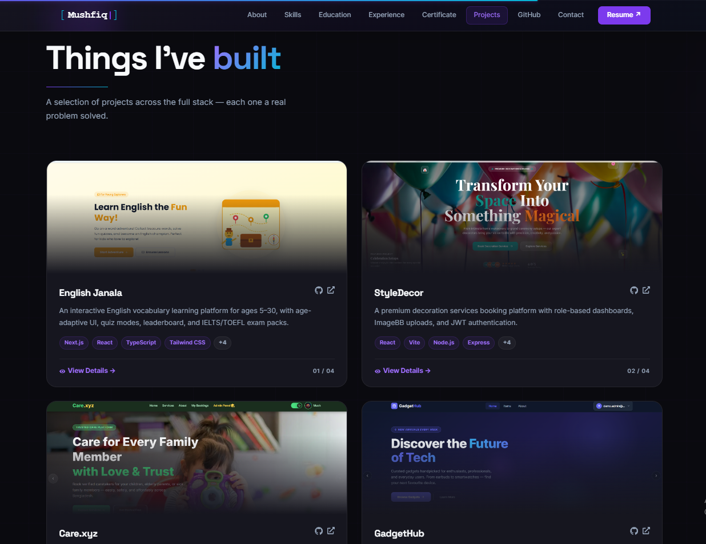
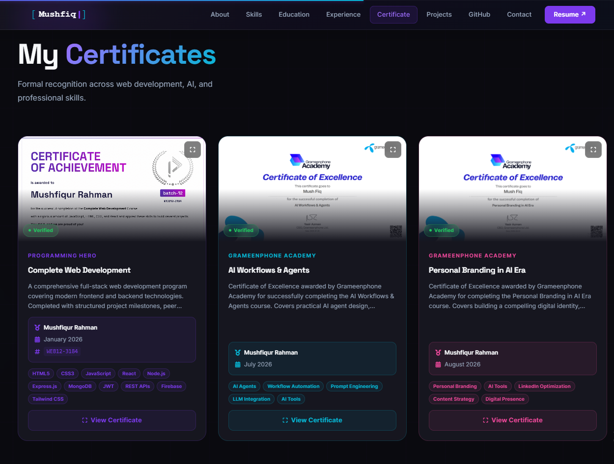
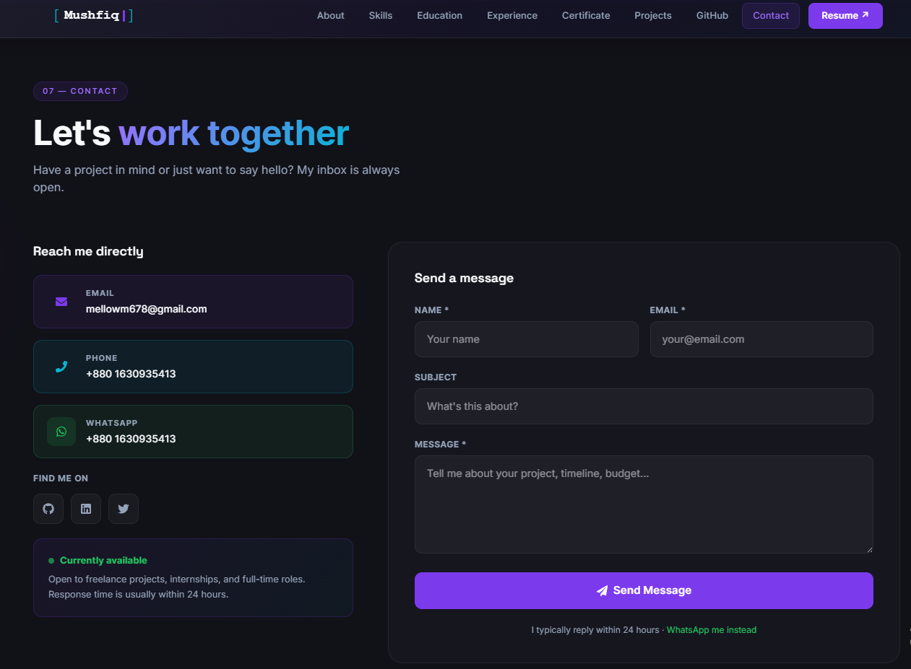

<div align="center">


</div>

<div align="center">

[](https://mushfiq-s-portfolio.vercel.app)
[](https://github.com/Mushfiq599/mushfiq-s-portfolio)
[](https://nextjs.org)
[](https://typescriptlang.org)
[](https://vercel.com)

</div>

---

## 📌 Project Overview

This is my **personal developer portfolio** — a production-grade, fully animated showcase of my skills, projects, experience, and certificates as a Full-Stack Web Developer from Bangladesh.

Built with **Next.js App Router** and **TypeScript**, the site features **GSAP** and **Framer Motion** animations, a live GitHub stats integration, a working contact form, downloadable resume, and a certificates section with verified credentials. Every section was designed from scratch with a dark minimalist aesthetic optimized for both performance and visual impact.

🌐 **Live:** [mushfiq-s-portfolio.vercel.app](https://mushfiq-s-portfolio.vercel.app)

---

## 🖼️ Screenshots

> **Hero Section**


> **About & Skills**


> **Projects Section**


> **Certificates Section**


> **Contact Section**


---

## ✨ Main Features

### 🎨 Design & Animations
- ⚡ **GSAP animations** — smooth entrance animations, scroll-triggered effects
- 🎬 **Framer Motion** — page transitions, hover effects, staggered reveals
- 🖱️ **Lenis smooth scrolling** — buttery smooth scroll experience
- 🌑 **Dark minimalist design** — clean black/dark aesthetic with cyan accent
- 📱 **Fully responsive** — pixel-perfect across mobile, tablet, and desktop

### 📄 Sections
- 👋 **Hero** — name, title, availability status, social links, animated intro
- 🧑 **About** — personal story, values, education summary, hobbies
- 🛠️ **Skills** — categorized tech stack — Frontend, Backend, Tools & DevOps
- 🎓 **Education** — full academic background with institution details
- 💼 **Experience** — project-based and open source work history
- 🏆 **Certificates** — verified certificates with credential IDs (Programming Hero, Grameenphone Academy)
- 🚀 **Projects** — showcase of 4 featured projects with links and tech tags
- 📊 **GitHub** — live language breakdown and contribution activity
- 📬 **Contact** — working contact form, email, phone, WhatsApp

### ⚙️ Technical Highlights
- 🔍 **Full SEO** — meta tags, Open Graph image, Twitter Card, robots, sitemap
- 📄 **Downloadable resume** — live PDF served from the `/public` folder
- 📊 **Live GitHub stats** — real-time language breakdown and contribution graph
- 💬 **WhatsApp integration** — direct message button linked to phone number
- 🐳 **Docker-ready** — containerized for consistent deployment
- ⚡ **Performance optimized** — Next.js image optimization, code splitting

---

## 🛠️ Tech Stack

| Technology | Purpose |
|---|---|
| Next.js 14+ (App Router) | Framework, SSR, routing, API routes |
| TypeScript | Type-safe codebase |
| Tailwind CSS | Styling and dark theme design |
| GSAP | Scroll-triggered and entrance animations |
| Framer Motion | Component animations and page transitions |
| Lenis | Smooth scrolling library |
| Vercel | Deployment and hosting |
| Docker | Containerization |
| Figma | UI design and prototyping |

---

## 📦 Dependencies

```json
{
  "dependencies": {
    "next": "^14.2.0",
    "react": "^18.3.1",
    "react-dom": "^18.3.1",
    "typescript": "^5.4.5",
    "framer-motion": "^11.2.0",
    "gsap": "^3.12.5",
    "@studio-freight/lenis": "^1.0.42",
    "tailwindcss": "^3.4.4",
    "react-icons": "^5.2.1"
  },
  "devDependencies": {
    "@types/node": "^20.14.0",
    "@types/react": "^18.3.3",
    "@types/react-dom": "^18.3.0"
  }
}
```

---

## ⚙️ Local Setup Guide

### Prerequisites
- Node.js v18+ installed
- Git installed

---

### 1. Clone the repository

```bash
git clone https://github.com/Mushfiq599/mushfiq-s-portfolio.git
cd mushfiq-s-portfolio
```

---

### 2. Install dependencies

```bash
npm install
```

---

### 3. Set up environment variables

Create a `.env.local` file in the project root:

```env
NEXT_PUBLIC_APP_URL=http://localhost:3000

# If using a contact form email service (e.g. Resend, EmailJS)
RESEND_API_KEY=your_resend_api_key
```

> ⚠️ If no email service is configured, the contact form works in UI-only mode.

---

### 4. Add your resume

Place your resume PDF at:

```
public/resume.pdf
```

It will be served at `/resume.pdf` and linked from the site automatically.

---

### 5. Run the development server

```bash
npm run dev
```

App will run at: `http://localhost:3000`

---

### 6. Docker setup (optional)

```bash
# Build the Docker image
docker build -t mushfiq-portfolio .

# Run the container
docker run -p 3000:3000 mushfiq-portfolio
```

---

## 🗂️ Project Structure

```
mushfiq-s-portfolio/
├── app/                    # Next.js App Router
│   ├── page.tsx            # Main portfolio page
│   ├── layout.tsx          # Root layout with metadata
│   └── api/                # API routes (contact form)
├── components/             # Section components
│   ├── Hero.tsx
│   ├── About.tsx
│   ├── Skills.tsx
│   ├── Projects.tsx
│   ├── Certificates.tsx
│   └── Contact.tsx
├── public/                 # Static assets
│   ├── resume.pdf          # Downloadable resume
│   └── images/             # Project screenshots
├── lib/                    # Utility functions
└── types/                  # TypeScript types
```

---

## 🌐 Live Link & Relevant Links

| Resource | Link |
|---|---|
| 🌐 Live Portfolio | [mushfiq-s-portfolio.vercel.app](https://mushfiq-s-portfolio.vercel.app) |
| 💻 GitHub Profile | [github.com/Mushfiq599](https://github.com/Mushfiq599) |
| 💼 LinkedIn | [linkedin.com/in/mush-fiq](https://linkedin.com/in/mush-fiq) |
| 🐦 Twitter/X | [x.com/MushFiq72288867](https://x.com/MushFiq72288867) |
| 📧 Email | [mellowm678@gmail.com](mailto:mellowm678@gmail.com) |
| 💬 WhatsApp | [wa.me/8801630935413](https://wa.me/8801630935413) |

---

<div align="center">


</div>
